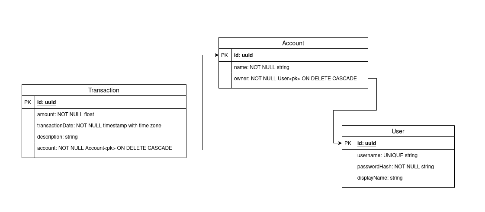

# Sprint: Database ORM

## Preface

This project is more complex than what you have seen before. It is supposed to mimic you graduating, getting your first job, being asked to handle a certain task. It is **normal** to feel overwhelmed.

Here are some pointers to help you through this:

- In bigger projects, you either have another team or developers work on separate tasks and parts of the project, so you do not need to and can not spend time trying to understand everything
- You will have a certain task, prioritize finding out _where_ in the code base you have to work on
- VSCode is your best friend, use `Ctrl/CMD + P` to quickly navigate through files, searching for terms like "migration", to help you find what you need
- You will need to get comfortable not knowing everything, keep in mind: CONJURE, CONJURE, CONJURE

## Introduction

Up to this point, you have managed to create database schema (using DDL), and are capable of manipulating data (using DML) in a relational database with SQL. However, there is still a disconnection between the database and your applications. How does a program communicate with databases?

In this sprint, you will be integrating a relational database with the business logic of an app, in the context of an expense manager app. In real life development, it is ubiquitous that developers use Object-Relation Mapping (ORM) libraries instead of writing raw SQL statements to abstract away the complexity of using databases in applications.

The mapping of RDBMS concepts and their representations in most ORM libraries are listed as below:

| RDBMS Concepts | ORM Representations   | Related Terms |
| -------------- | --------------------- | ------------- |
| schema         | collection of classes |               |
| table          | class                 | model         |
| row/record     | class instance        | model         |
| column         | class property        | field         |

However, using an ORM does not translate to "SQL is not important". Here are some reasons why:

1. While most ORM libraries come with features to generate migrations by detecting the changes made in models. It is always advisable to inspect the SQL DDL generated or you may risk losing data
2. The concepts we learnt while using SQL, including joining, aggregating, filtering, batching are essentail to make sure we use ORM libraries efficiently
3. (You can skip this point until later) Migrations generated by ORM libraries may be less efficient for large dataset. It may cause the DBMS to acquire a table-level lock during migration. When the number of records in the table is huge, the table can be locked for a long time and consequently affect the availability of depending services. Thus, you may need to manually intervene and optimize the SQL generated.

## Objectives

- Understanding the concepts of Object-Relation Mapping (ORM)
- Understanding database migrations and how they work in the context of ORM
- Hands on building an expense manager API that supports CRUD operations in TypeScript
- Hands on using an ORM to perform more complex operations (joining, aggregating, filtering, etc)
- (Bonus) Understanding basics of user authentication using JWT and bcrypt

## Environment

### Postgres

You will need postgres installed. If you haven't installed it already, download and install the [PostgresApp](https://postgresapp.com/) and verify its working by running the command `psql` in your terminal.

#### Create a database

1. Log into your `psql` shell, and create a new database and name it `expense_manager`:

   ```
   CREATE DATABASE expense_manager
   ```

2. Verify the database is created properly by switching to it in your `psql` shell:
   ```
   \c expense_manager
   ```

### Configuring Environment Variables Using `dotenv`

Once the database is ready, we shall take a detour to learn about environment variables. Environment variables are variable that live outside of our programs and are globally accessible in a particular environment. Application configurations and credentials are quintessential values stored as environment variables.

#### Reading Environment Variables

To view a list of environment variables, run `process.env` in your Node shell:

```
Welcome to Node.js v12.16.1.
Type ".help" for more information.

> process.env
{
  SHELL: '/bin/bash',
  HOME: '/home/melvin',
  USERNAME: 'melvin',
  ...
}
```

Depending on your environment, you should see a bunch of values. These are typically set by the operating system or user programs.

To reference to a particular environment variable, let's say `DB_URL`, all you need is to access it via the `process.env` object:

```
const DB_URL = process.env.DB_URL || "a default value"
```

#### Setting Environment Variables

In JavaScript and TypeScript, the package `dotenv` is usually employed to deal with environment variables. With the help of `dotenv`, setting and reading environment variables involve 3 steps:

1. Create a new file `.env` in the project directory and list all our environment variables. E.g.:

   ```
   DB_NAME=expense_manager
   DB_USER=melvin
   DB_PASSWORD=melvin
   DB_HOST=localhost
   DB_PORT=5432
   ```

2. Load the `.env` file when the program starts. To achieve this, there are several ways at our disposal:

   - [Preload `.env` when running a script](https://www.npmjs.com/package/dotenv#preload): The scripts in this project are set up to preload `.env`. Any scripts should be able to access the variables defined in `.env`.
   - [Run `require('dotenv').config()` at the entrypoint of your app](https://www.npmjs.com/package/dotenv#usage)

3. In your programs, read the variables via the `process.env` object:
   ```
   console.log(process.env.DB_NAME)    // "expense_manager"
   ```

As a general rule of thumb, all sensitive information should be defined in environment variables instead of hard coding them in the source code. With `dotenv`, you list your application configurations and credentials in the `.env` file alongside with `package.json`. Make sure you add `.env` into your `.gitignore` file and never commit it.

### Before Installing Dependencies

Please make sure you have Node v12 (LTS) installed and activated.

To check the version you're using, run:

```
node -v
```

### Installing Dependencies and Startup

Example:

To install dependencies:

```bash
    npm install
```

To check if your database configuration is properly set up:

```bash
npm run testConnection
```

To run tests:

```bash
    npm run test
```

To run the app in development mode:

```bash
    npm run dev
```

## Objectives and Instructions

The expense manager API in this sprint is capable of:

- Handling user registration, and authentication
- Handling CRUD operations of accounts
- Handling CRUD operations of transactions (both expense and income)

This expense manager API should be built adhering to REST principles, and makes extensive use of HTTP status codes. You will be implementing mostly the controller logic, and `Manager` objects that interacts with the database using TypeORM.

### Basic Requirements

- [ ] Ensure your dev environment is ready

  - [ ] Install dependencies
  - [ ] Update your environment variables with database credentials as shown in `src/ormconfig.ts` or modify the config file directly
  - [ ] Run `npm run dev` and make sure your server is listening at the port prescribed (default is `5000`)
  - [ ] All set! Shutdown the server as you will be focusing on passing tests

- [ ] Take 20-30 minutes to understand the structure of the project. Pay particular attention to:

  - [ ] how the app is started in `src/index.ts`
  - [ ] how database credentials, app configurations are passed into the app
  - [ ] how business logic is broken down to services and entities in `src/services/*` and `src/entities`

- [ ] Take a look at `entities` and run your initial migrations
  - [ ] All entities in this sprint, in fact, in most real life applications are represented with **Classes**. Take a look at all entities in `src/entities/*.ts` and don't worry if you see partially implemented classes. You will be completing them soon
  - [ ] As you have seen in `src/entities/UserModel.ts`, the `User` model is already implemented. We have also generated the initial migration for you. Navigate to `src/migrations/*-CreateUser.ts` to get a feeling of how a generated migration is
  - [ ] Run your first migration using `npm run migrate`
  - [ ] Make sure the `user` table is created in your database, you can do so by using `psql`
- [ ] Make tests pass
  - [ ] Run tests using `npm run test`, you should see a list of failing tests
  - [ ] Navigate to `src/services/users/manager.ts` and look for methods with `FIXME` in their docstrings:
    - [ ] Implement `UserManager -> getUser()` and pass relevant tests
    - [ ] Implement `UserManager -> updateUser()` and pass relevant tests
    - [ ] Implement `UserManager -> removeUser()` and pass relevant tests
    - > 💡 Tip 💡 Pay attention to how `UserController` and other implemented methods in `UserManager` work
    - [ ] Navigate to `src/tests/index.ts`, and remove `.only()` from the test suite for **Auth and user services**:
          `- describe.only("Auth and user services", () => { ... + describe("Auth and user services", () => { ...`
- [ ] Understand database seeding

  - [ ] Navigate to `src/seeds/createDummyUser.ts`, follow the instructions given and populate your database with a dummy user `codechrysalis`

- [ ] Understand the idea of using configuration files:

  - [ ] Navigate to `src/ormconfig.ts`, read the comments at the top of the file

- [ ] Complete classes representing `Account` and `Transaction` entities as below:

  - 
  - [ ] Define model fields and relationships in `Account` and `Transaction`
    > 💡 Tip 💡 You can define `@ManyToOne` relationship without having `@OneToMany` on the related entity ([source](https://github.com/typeorm/typeorm/blob/master/docs/many-to-one-one-to-many-relations.md))
  - [ ] Create a new migration file using `npm run makeMigrations -n <MigrationName>`
  - [ ] Before applying the newly generated migration, verify the SQL statements in migration files created are exactly what you want. If not, delete the migration, fix your models, then regenerate the migration. (**You should not modify generated migrations other than style fixing**)
  - [ ] Run migration using `npm run migrate`, and verify the schema created using `psql`
  - [ ] (Optional) If you need to rollback the migrations ran, consult the documentation of TypeORM and define the script `rollback` in `package.json`

- [ ] Complete the logic in service controllers and managers.

  - [ ] Spend several minutes to locate test cases for respective controllers and managers in `src/tests/index.ts`
    > 💡 Tip 💡 You can always use `.skip()` or `.only()` to specify which test cases to run
  - [ ] Look for `FIXME` in Account service (`src/services/account/*.ts`), fix them, and pass the tests
    - [ ] Uncomment the line in the constructor of `AccountManager` as instructed in the comment
    - [ ] Implement `AccountManager -> getAccount()` and pass relevant tests
      > 💡 Tip 💡 You will need to join `account` with `transaction` table
    - [ ] Implement `AccountManager -> createAccount()` and pass relevant tests
    - [ ] Implement `AccountManager -> updateAccount()` and pass relevant tests
    - [ ] Implement `AccountManager -> deleteAccount()` and pass relevant tests
  - [ ] Look for `FIXME` in Transaction service (`src/services/transaction/*.ts`), fix them, and pass the tests.
    - [ ] Uncomment the line in the constructor of `TransactionManager` as instructed in the comment
    - [ ] Implement `TransactionManager -> getTransaction()` and pass relevant tests
    - [ ] Implement `TransactionManager -> createTransactiom()` and pass relevant tests
    - [ ] Implement `TransactionManager -> deleteTransaction()` and pass relevant tests
    - [ ] Implement `TransactionManager -> listTransactionsByIds()` and pass relevant tests
    - [ ] Implement `TransactionManager -> listTransactionsInAccount()` and pass relevant tests
    - [ ] Implement `TransactionManager -> filterTransactionsByAmountInAccount()` and pass relevant tests

- [ ] **Recommended Read** While this sprint is about database ORM, that's not all. We deliberately included some basics of authentication to make this project even closer to real life applications. Take a look at Auth service and understand:
  - [ ] how users are created
  - [ ] how users sign in by exchanging user credentials for [JWT tokens](https://jwt.io/introduction/)
  - [ ] how users authenticate themselves using JWT tokens obtained
  - [ ] how username and password are store in database with the help of `bcrypt`
  - [ ] how user tokens are checked using `src/authentication.ts -> guarded()` function as shown in all `subclasses of BaseController -> createRouter()` method

### Advanced Requirements:

- [ ] Understand how database connection works in TypeORM
  - [ ] Navigate to `src/database.ts` and read the code comments
- [ ] Implement logic to catch duplicate sign-up and present the error nicely with appropriate HTTP status code back to users
- [ ] Bring your API closer to real life applications:
  - [ ] Our API should not allow users to access data of others. Unskip and pass these test cases
    - [ ] `'Auth and user services' -> 'should restrict access by unauthorised user'`
    - [ ] `'Account service' -> 'should restrict access by unauthenticated user'`
    - [ ] `'Account service' -> 'should restrict access by unauthorised user'`
    - [ ] `'Transaction service' -> 'should restrict access by unauthenticated user'`
    - [ ] `'Transaction service' -> 'should restrict access by unauthorised user'`
  - [ ] When handling delete requests, it is common that records in database are be deleted but are however marked as "deleted" by using a special column in the table. This technique is known as "soft deletion". Dive into the wilderness of the internet, research on this topic and implement it for all entities
  - [ ] Implement a new feature to allow user to download all their transaction records as CSV files

## References

- [TypeORM: Understanding Entities](https://typeorm.io/#/entities)
- [TypeORM: Advanced `find` Options](https://github.com/typeorm/typeorm/blob/master/docs/find-options.md#advanced-options)
- [TypeORM: Defining Many-To-One Relationship](https://github.com/typeorm/typeorm/blob/master/docs/many-to-one-one-to-many-relations.md)
- [node-jsonwebtoken](https://github.com/auth0/node-jsonwebtoken#readme)
- [`this` in TypeScript](https://github.com/microsoft/TypeScript/wiki/%27this%27-in-TypeScript#use-instance-functions)
- [`@JoinColumn` options](https://orkhan.gitbook.io/typeorm/docs/relations#joincolumn-options)
